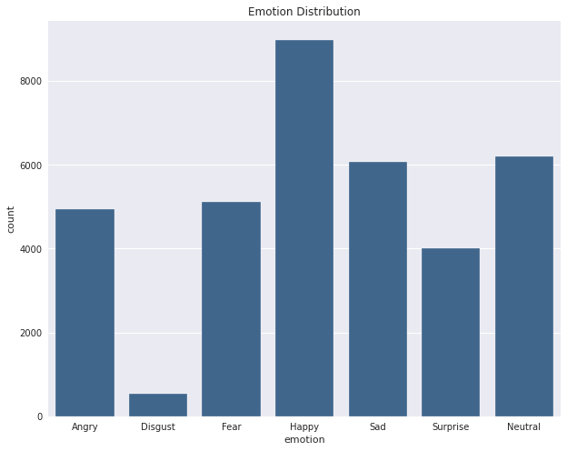

# Emotion Detection Using Mini-Xception Architecture

This architecture is inspired by Xception. This repository uses Mini-Xception(Model Code written from scratch and trained on FER2013) model to detect facial expressions and classify emotions(please go to the [architecture](#Architecture) for more information on how it works). You can also check out the [Usage](#Usage) section to see how to use the code.

## Prediction on SampleImages

The picture of facial expressions classified by the model.
<br>


## Setup

### pip

`pip install -r requirements.txt`

## Emotions 

This model will detect 7 facial expressions

- Anger
- Disgust
- Fear
- Neutral
- Happy
- Sad
- Surprise

## Usage
```
Usage: app.py

```
## Architecture

The code is having two parts, as given below

### Face Detection

Used haarcascade classifier to detect the faces in the image. We are using the `haarcascade_frontalface_default.xml` file which is a haar cascade designed by OpenCV to detect the frontal face.
You can visit this [website](https://medium.com/analytics-vidhya/haar-cascades-explained-38210e57970d) for any more information on how this classifier works.

### Facial Emotion Detection


Written the code for building Fully-convolutional neural network architecture known as Mini-Xception. You can read about Mini-Xception in this Paper [here](https://arxiv.org/pdf/1710.07557.pdf) to find out more. This model was trained on FER2013 Dataset, which has 35987 facial expressions. You can find the distribution of facial expressions of the dataset below.




## About the Application 

The Application built looks like this
<br>

There are maily three features that are added in the applications

### Browse file

You can upload your image through browsing for the file on your device, make sure that you select an image of .png, .jpg, .jpeg other uploads will not be accepted by the application. After successfully uploading the image, application moves to anothor webpage which has the predicted result.


### Drag & Drop

You can drop any image file over the drag & drop area. After successfully dropping the file you can see the predictions made by the image.

### Click from Camera

Here we are accessing the Web Camera of the User to capture the image when user clicks on capture button. After successfully capturing the image application redirects you to another page where you can see the predictions made by the your photo. 


### Application Host

The application has been hosted on Heroku. You can visit to the hosted web application [here](https://emotiondetectioncnn.herokuapp.com/).


